# Eventer - User Manual

[English](#english) | [Slovak](#slovak)

## English

### Introduction
This user manual guides you through using the **Eventer** plugin for Redmine to automate employee assignments to tasks or events. The plugin requires initial configuration of projects, roles, users, qualifications, and user availability before creating tasks and running the optimization algorithm. Follow the steps in order to ensure proper functionality.

### Prerequisites
- Redmine 6.0.2 instance with Eventer plugin installed (see `README.md` for installation).
- Administrator access for configuration.
- User accounts for team members.
- Basic familiarity with Redmine’s interface.

### Steps to Use Eventer

#### 1. Log in to Redmine
Access your Redmine instance to begin configuration.

- **Action**: Navigate to your Redmine URL (e.g., `http://your-redmine-instance.com`) and log in with your username and password.
- **Screenshot**:
  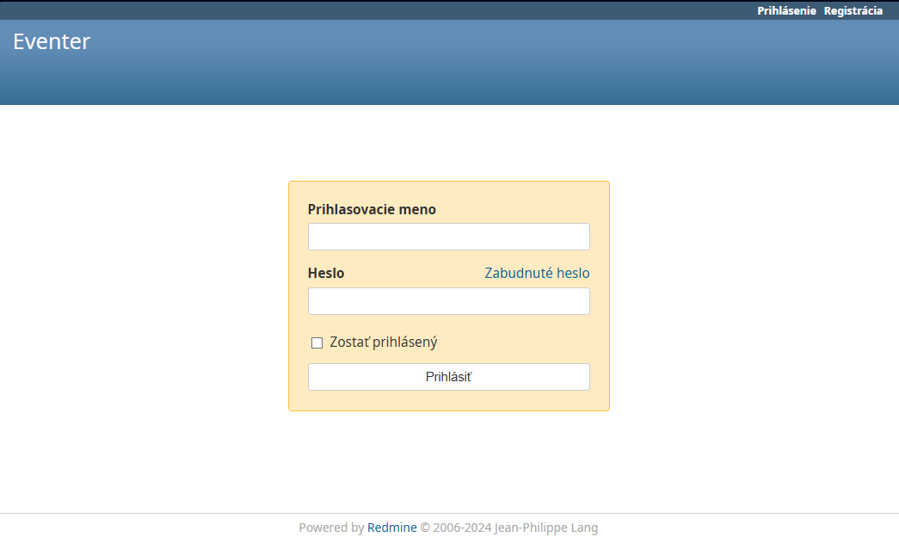

#### 2. Configure a Project and Tracker
Set up a project and enable the Eventer plugin to manage tasks and assignments.

- **Action**:
  1. Go to **Administration** > **Projects** > **New project** or select an existing project.
  2. Enter project details (e.g., Name, Identifier).
  3. Save the project.
  4. Go to **Administration** > **Trackers**.
  5. Create a new tracker and assign it to the project.
- **Screenshot**:
  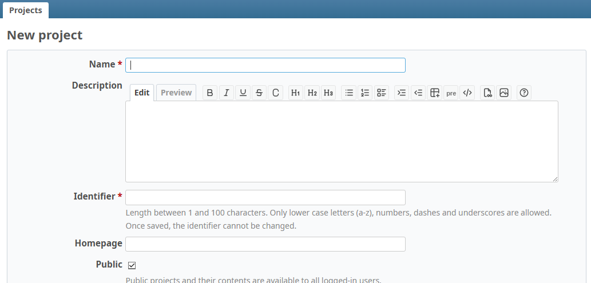
- 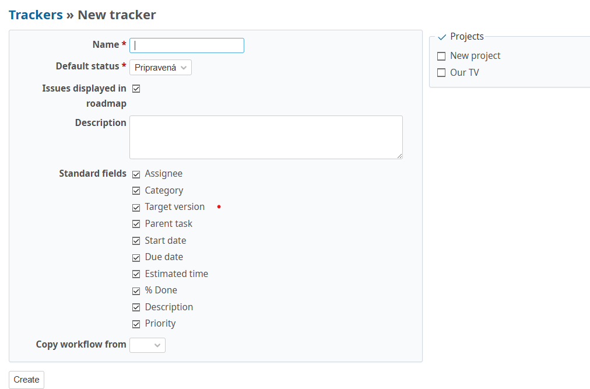

#### 3. Set Up Roles and Permissions
Define roles for users and assign permissions for Eventer features.

- **Action**:
  1. Go to **Administration** > **Roles and permissions**.
  2. Create or edit a role (e.g., “Event Manager”).
  3. Enable permissions such as **View issues**, **Manage issue assignments**...
  4. Save the role.
- **Note**: Ensure roles are configured before adding users to the project.
- **Screenshot**:
  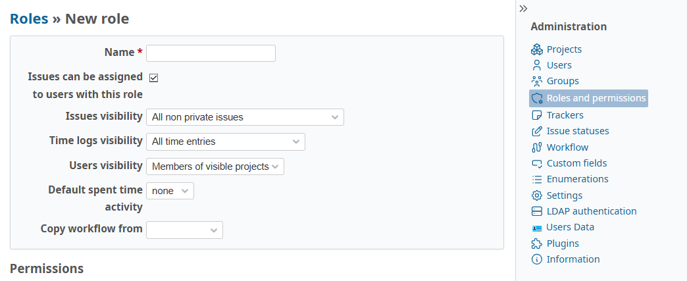

#### 4. Create Users and Assign Roles
Add team members and assign them roles within the project.

- **Action**:
  1. Go to **Administration** > **Users** > **New user**.
  2. Enter user details (e.g., Login, First name, Last name, Email).
  3. In the project, go to **Settings** > **Members** > **New member**.
  4. Add the user and assign a role (e.g., “Director”).
- **Note**: All team members must be added before defining qualifications.
- **Screenshot**:
  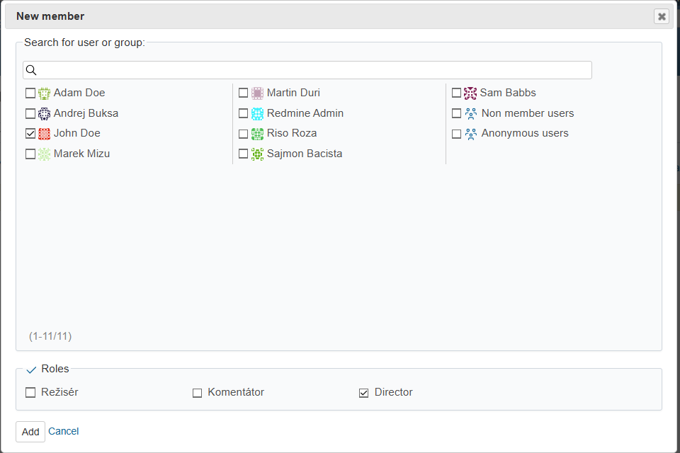

#### 5. Define User Qualifications
Specify qualifications to match users with tasks.

- **Action**:
  1. Go to **Administration** > **Users Data**.
  2. Choose user who will be assigned qualifications.
  3. Add new qualification, choose Role, Category, and Rating.
  4. Save the settings.
- **Note**: Optimization algorithm requires qualifications to assign users correctly.
- **Screenshot**:
  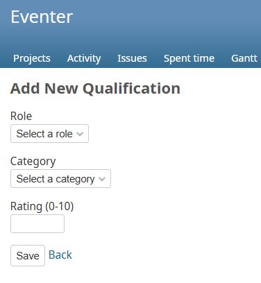

#### 6. Enter User Availability
Users must specify their availability before tasks are created.

- **Action**:
  1. Log in as a user.
  2. Go to **Off days** tab (on the top bar, added by Eventer).
  3. Enter days off or unavailable periods (e.g., specific dates).
  4. Save changes.
- **Note**: All users must complete this step to ensure the algorithm has accurate data.
- **Screenshot**:
  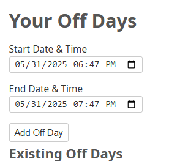

#### 7. Choose User Preferences
Users specify their preferences for task assignments to optimize their roles.

- **Action**:
  1. Log in as a user.
  2. Go to **Filters** tab (on the top bar, added by Eventer) > **New filter**.
  3. Select conditions and roles, on each choose operator, Value and Variable. (You can concatenate multiple conditions using AND and OR).
  4. Save changes.
- **Note**: Preferences help the optimization algorithm prioritize user assignments.
- **Screenshot**:
  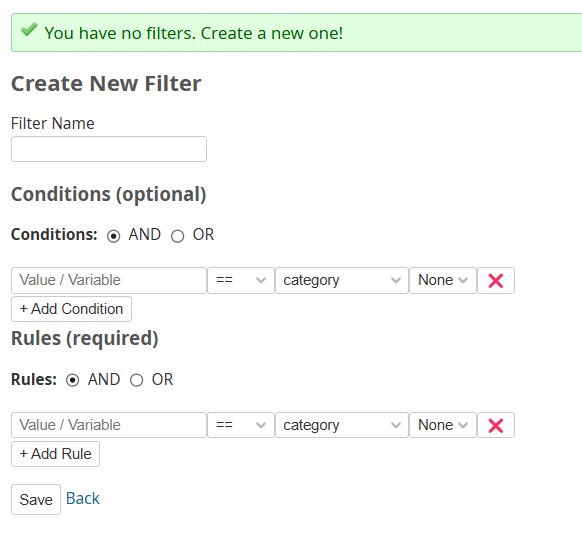

#### 8. Create a Task (Issue) with Required Roles
Create tasks only after all configuration and user data are complete.

- **Action**:
  1. In the project, go to **Issues** > **New issue**.
  2. Fill in issue details (e.g., Subject, Description, Start datetime, End datetime).
  3. In the **Required Roles** section (added by Eventer), select roles (e.g., “Režisér”) and specify the required count.
  4. Optionally assign users manually or leave for the algorithm.
  5. Save the issue.
- **Screenshot**:
  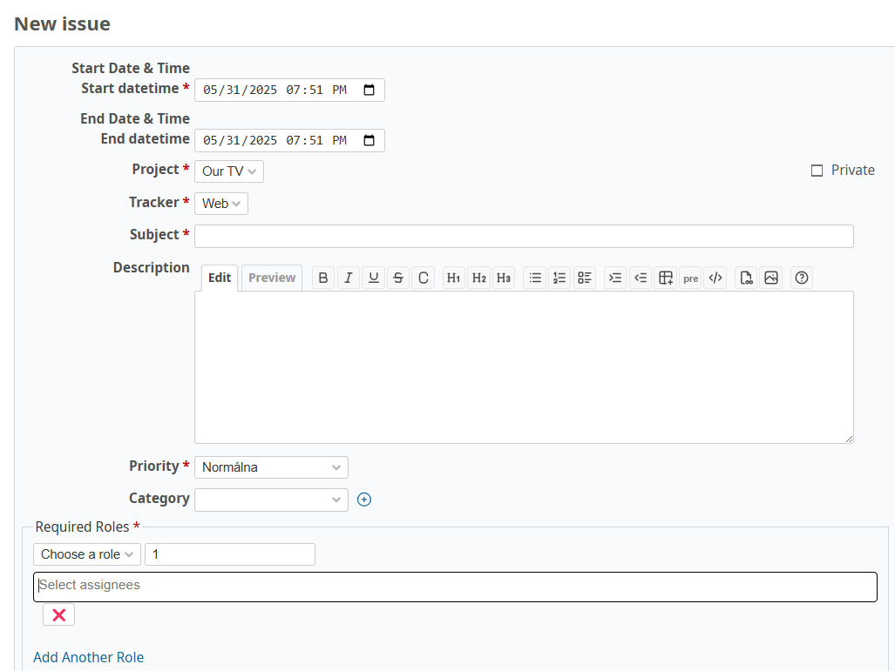

#### 9. Run the Optimization Algorithm
Run the algorithm to assign users to tasks based on qualifications, availability, and preferences.

- **Action**:
  1. As an administrator, go to the **Administration** tab > **User Data** > **Go to Algorithm Runner**.
  2. Choose date range if needed. Check Allow partial solution if needed.
  3. Run the algorithm by clicking **Assign Tasks**.
- **Note**: This step requires all previous steps to be completed for accurate assignments.
- **Screenshot**:
  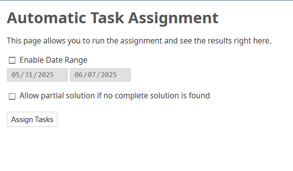

#### 10. View Assignment Results
Review assigned users in logs, user profiles, and issue details.

- **Action**:
  1. Check the optimization log in the **Algorithm Runner** tab to see assigned users per task.
  2. Login as a user and check the **Issues** tab in their view to see their tasks.
  3. Open the issue to see assigned users in the **Required Roles** section.
- **Screenshots**:
  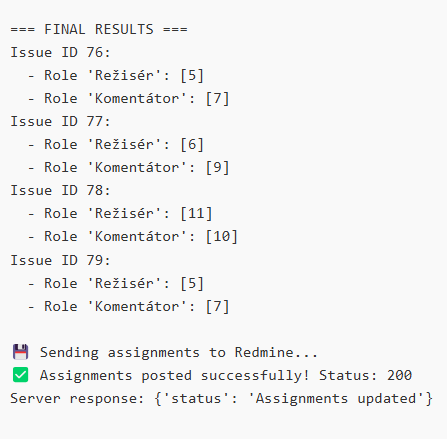
  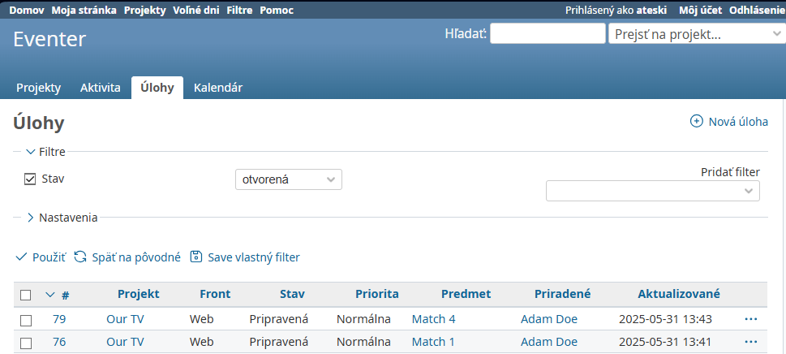
  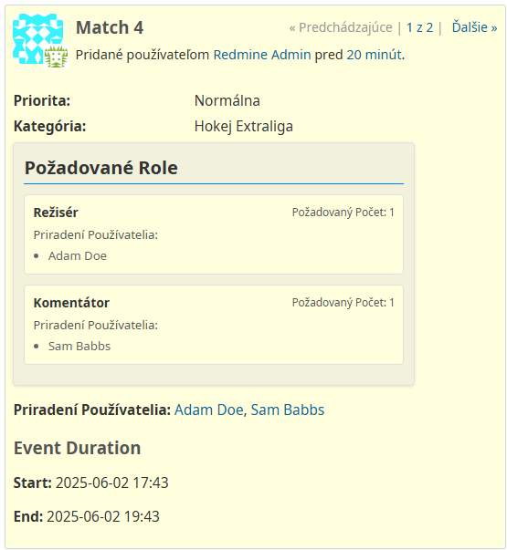

### Troubleshooting
- **Issue not visible**: Verify the user has **View issues** permission and is assigned via **Required Roles**.
- **Algorithm fails**: Ensure qualifications, availability, and roles are correctly set.
- **Contact**: Report issues at `https://github.com/your-username/eventer/issues`.

---

## Slovak

### Úvod
Táto používateľská príručka vás prevedie používaním pluginu **Eventer** pre Redmine, ktorý automatizuje priradenie zamestnancov k úlohám alebo udalostiam. Plugin vyžaduje počiatočnú konfiguráciu projektov, rolí, používateľov, kvalifikácií a dostupnosti pred vytváraním úloh a spustením optimalizačného algoritmu. Postupujte podľa krokov v poradí, aby ste zabezpečili správnu funkčnosť.

### Požiadavky
- Inštancia Redmine 6.0.2 s nainštalovaným pluginom Eventer (pozri `README.md` pre inštaláciu).
- Prístup administrátora na konfiguráciu.
- Používateľské účty pre členov tímu.
- Základná znalosť rozhrania Redmine.

### Kroky na použitie Eventeru

#### 1. Prihlásenie do Redmine
Prihláste sa do vašej Redmine inštancie, aby ste začali s konfiguráciou.

- **Akcia**: Prejdite na URL vášho Redmine (napr. `http://your-redmine-instance.com`) a zadajte používateľské meno a heslo.
- **Snímka obrazovky**:
  

#### 2. Konfigurácia projektu a fronty
Nastavte projekt na správu úloh a priradení.

- **Akcia**:
  1. Prejdite na **Administrácia** > **Projekty** > **Nový projekt** alebo vyberte existujúci projekt.
  2. Zadajte detaily projektu (napr. Názov, Identifikátor).
  3. Uložte projekt.
  4. Prejdite na **Administrácia** > **Fronty**.
  5. Vytvorte novú frontu a priraďte ju k projektu.
- **Snímka obrazovky**:
  
  

#### 3. Nastavenie rolí a oprávnení
Definujte role pre používateľov a priraďte oprávnenia pre funkcie Eventeru.

- **Akcia**:
  1. Prejdite na **Administrácia** > **Roly a oprávnenia**.
  2. Vytvorte alebo upravte rolu (napr. „Manažér udalostí“).
  3. Povoľte oprávnenia ako **Zobraziť problémy**, **Spravovať priradenia problémov**...
  4. Uložte rolu.
- **Poznámka**: Roly musia byť nakonfigurované pred pridaním používateľov do projektu.
- **Snímka obrazovky**:
  

#### 4. Vytvorenie používateľov a priradenie rolí
Pridajte členov tímu a priraďte im role v projekte.

- **Akcia**:
  1. Prejdite na **Administrácia** > **Používatelia** > **Nový používateľ**.
  2. Zadajte detaily používateľa (napr. Prihlasovacie meno, Meno, Priezvisko, Email).
  3. V projekte prejdite na **Nastavenia** > **Členovia** > **Nový člen**.
  4. Pridajte používateľa a priraďte rolu (napr. „Režisér“).
- **Snímka obrazovky**:
  

#### 5. Definovanie kvalifikácií používateľov
Určite kvalifikácie na priradenie používateľov k úlohám.

- **Akcia**:
  1. Prejdite na **Administrácia** > **Dáta používateľov**.
  2. Vyberte používateľa, ktorému budú priradené kvalifikácie.
  3. Pridajte novú kvalifikáciu, vyberte Rolu, Kategóriu a Hodnotenie.
  4. Uložte nastavenia.
- **Poznámka**: Kvalifikácie sú nevyhnutné pre správne priradenie používateľov algoritmom.
- **Snímka obrazovky**:
  

#### 6. Zadanie dostupnosti používateľov
Používatelia musia zadať svoju dostupnosť pred vytvorením úloh.

- **Akcia**:
  1. Prihláste sa ako používateľ.
  2. Prejdite na kartu **Voľné dni** (v hornom paneli, pridaná Eventerom).
  3. Zadajte dni voľna alebo obdobia nedostupnosti (konkrétne dátumy).
  4. Uložte zmeny.
- **Poznámka**: Všetci používatelia musia dokončiť tento krok, aby mal algoritmus presné údaje.
- **Snímka obrazovky**:
  

#### 7. Výber preferencií používateľov
Používatelia určujú svoje preferencie pre priradenie úloh, aby optimalizovali svoje role.

- **Akcia**:
  1. Prihláste sa ako používateľ.
  2. Prejdite na kartu **Filtre** (v hornom paneli, pridaná Eventerom) > **Nový filter**.
  3. Vyberte podmienky a role, pre každú zvoľte operátor, hodnotu a premennú. (Môžete kombinovať viacero podmienok operátorov AND a OR).
  4. Uložte zmeny.
- **Poznámka**: Preferencie pomáhajú optimalizačnému algoritmu uprednostniť priradenia používateľov.
- **Snímka obrazovky**:
  

#### 8. Vytvorenie úlohy (problému) s požadovanými rolami
Vytvárajte úlohy až po dokončení konfigurácie a zadania údajov.

- **Akcia**:
  1. V projekte prejdite na **Úlohy** > **Nová úloha**.
  2. Vyplňte detaily problému (napr. Predmet, Popis, Dátum a čas začiatku, Dátum a čas konca).
  3. V sekcii **Požadované role** (pridanej Eventerom) vyberte role (napr. „Režisér“) a určite požadovaný počet.
  4. Voliteľne priraďte používateľov manuálne alebo nechajte na algoritmus.
  5. Uložte problém.
- **Poznámka**: Pred vytvorením úloh musia byť dokončené projekty, používatelia, kvalifikácie a dostupnosť.
- **Snímka obrazovky**:
  

#### 9. Spustenie optimalizačného algoritmu
Spustite algoritmus na priradenie používateľov k úlohám.

- **Akcia**:
  1. Ako administrátor prejdite na kartu **Administrácia** > **Dáta používateľov** > **Spúšťač algoritmu**.
  2. Ak je potrebné, vyberte časové obdobie. Zaškrtnite **Povoliť čiastočné riešenie**, ak je to potrebné.
  3. Spustite algoritmus kliknutím na **Prideliť úlohy**.
- **Poznámka**: Tento krok vyžaduje dokončenie všetkých predchádzajúcich krokov pre presné priradenie.
- **Snímka obrazovky**:
  

#### 10. Zobrazenie výsledkov priradení
Skontrolujte priradených používateľov v logoch, profiloch a detailoch problémov.

- **Akcia**:
  1. Pozrite si log optimalizácie na karte **Spúššač algoritmu**, kde uvidíte priradených používateľov pre úlohy.
  2. Prihláste sa ako používateľ a skontrolujte kartu **Úlohy** v jeho zobrazení, kde uvidí svoje úlohy.
  3. Otvorte úlohu a pozrite si priradených používateľov v sekcii **Požadované role**.
- **Snímky obrazovky**:
  
  
  

### Riešenie problémov
- **Úloha nie je viditeľná**: Uistite sa, že používateľ má oprávnenie **Zobraziť úlohy** a je priradený cez **Požadované role**.
- **Algoritmus zlyhá**: Skontrolujte, či sú kvalifikácie, dostupnosť a role správne nakonfigurované.
- **Kontakt**: Hlásenie problémov na `https://github.com/your-username/eventer/issues`.